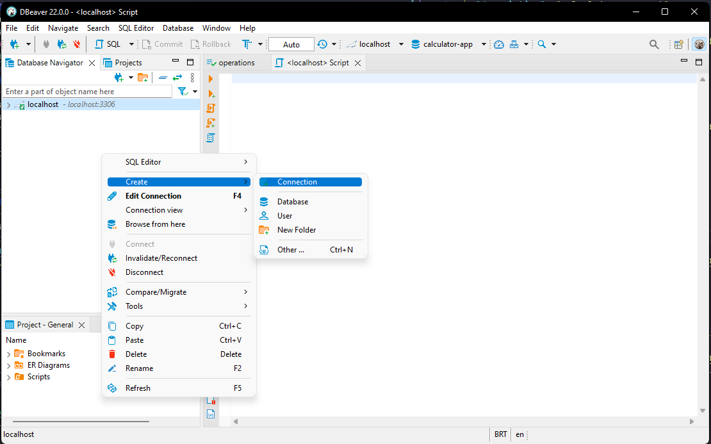
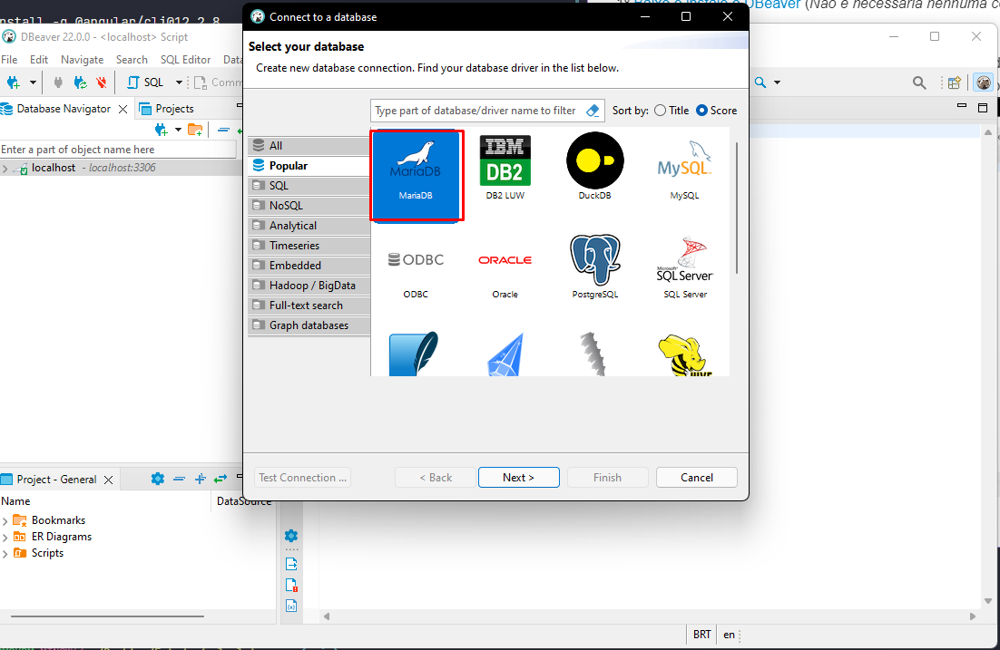
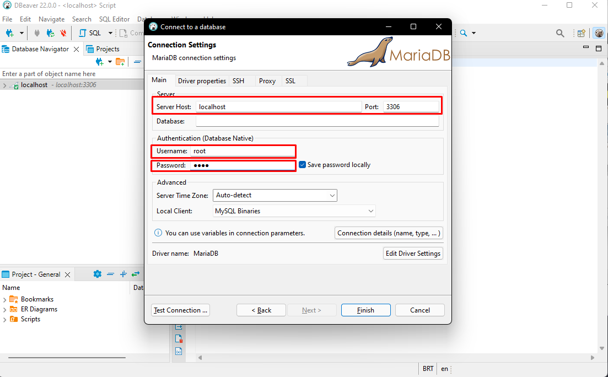
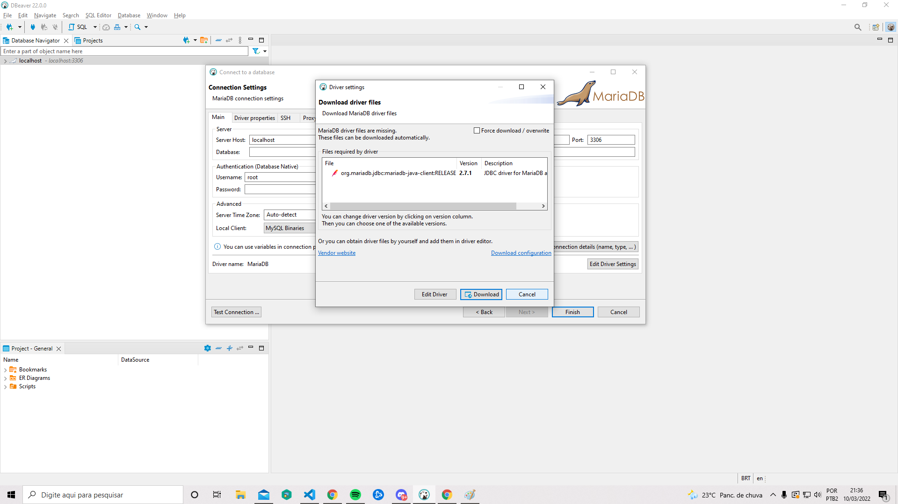
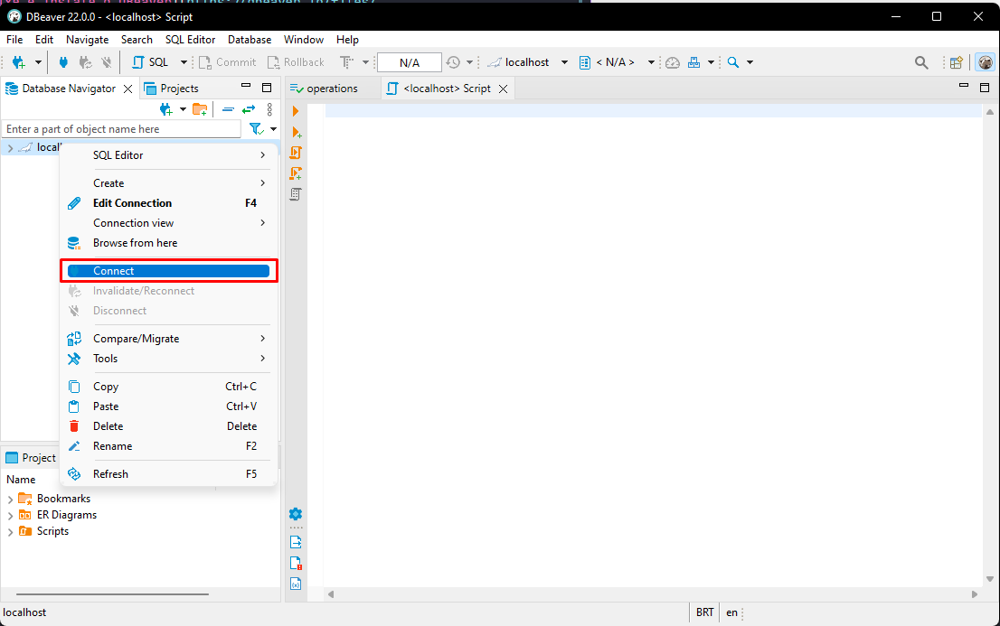
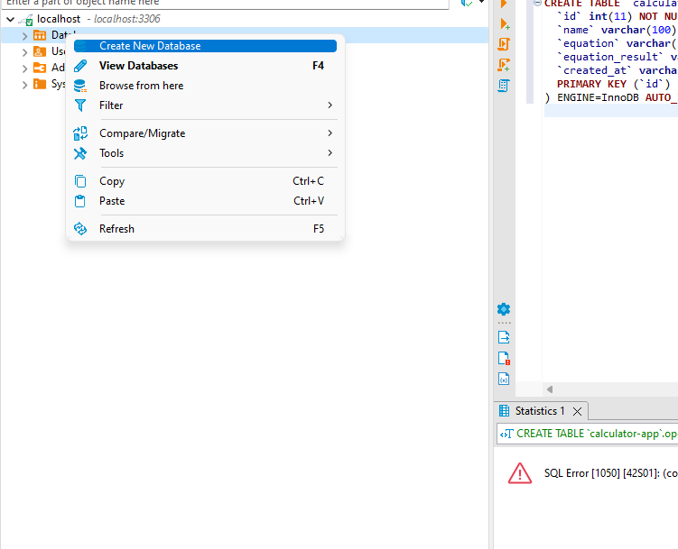
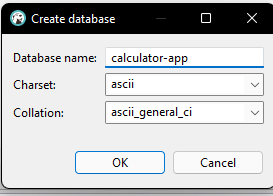
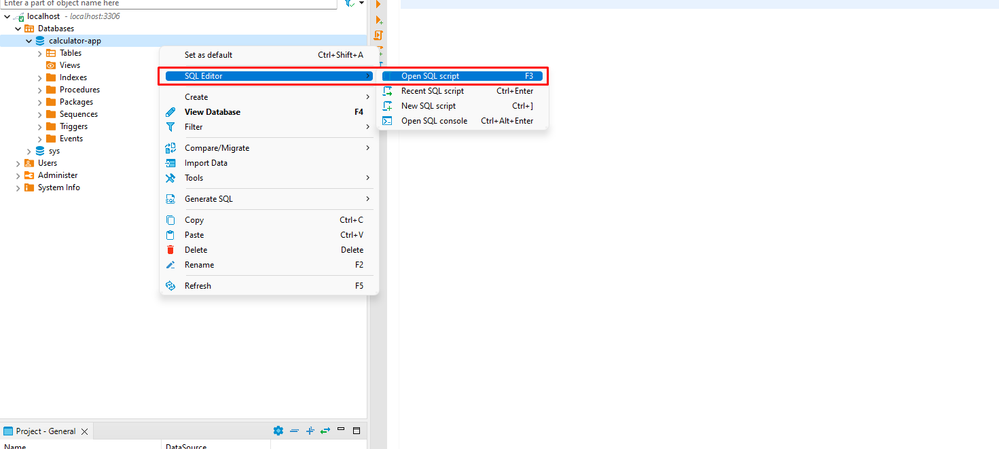
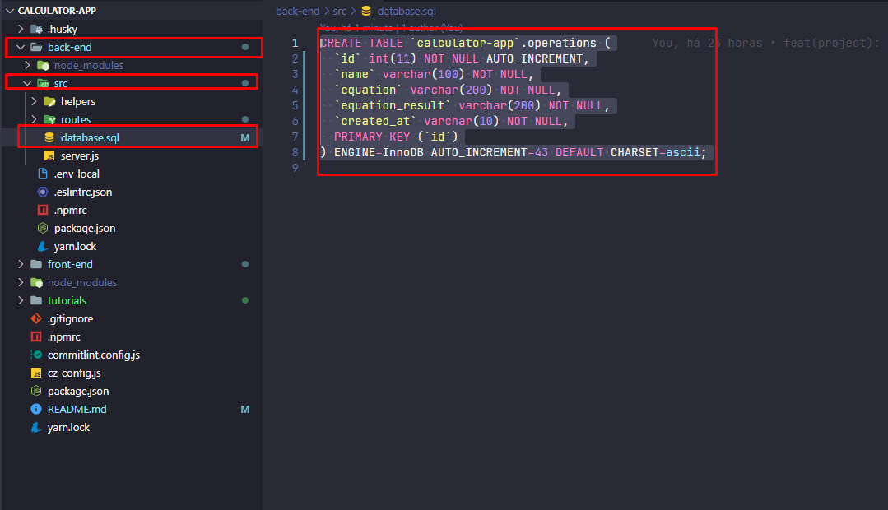
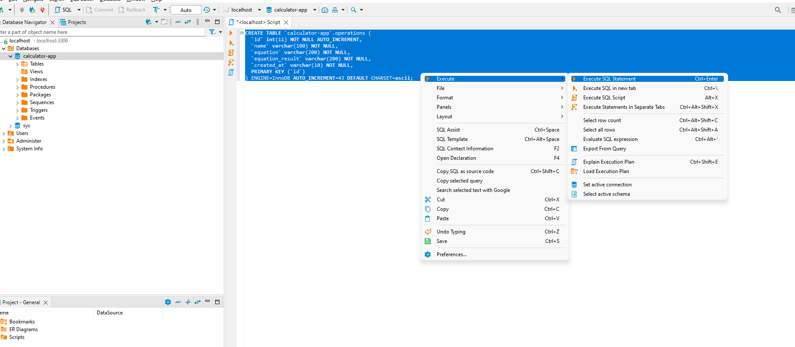

# Calculator-app


## Estrutura
O projeto possui três camadas: **Front-end**; **Back-end**; **Banco de dados**.

Antes de executar o projeto, é necessário realizar algumas etapas de seu setup.

## 1º Node
Antes de qualquer coisa, é necessário que haja uma instalação do **node** em sua máquina, sendo assim caso já possua, você pode seguir para a **2º Etapa**.
[Clique aqui para instalar o node](https://nodejs.org/dist/v16.14.0/node-v16.14.0-x64.msi)
## 2º Front-end
**OBS**: Essa etapa não é necessária caso possua o **angular** instalado na sua máquina.
Abra o terminal (_não precisa ser em nenhum lugar específico_) e execute o seguinte comando:
```
  npm install -g @angular/cli@12.2.8
```

## 2º Banco de dados
**OBS**: Essa etapa não é necessária caso possua o **DBeaver** e **Mariadb** instalado em sua máquina.
**1º** [Baixe e instale o DBeaver](https://dbeaver.io/files/dbeaver-ce-latest-x86_64-setup.exe) (_Não é necessária nenhuma configuração adicional, apenas próximo e próximo_)

**2º** Com o DBeaver instalado, abra-o e na janela esquerda denominada "Database Navigator", clique com o botão direito e selecione "Create" - "Connection".


**3º** Selecione MariaDB (talvez seja necessário buscar na barra de busca da janela).


**4º** Após essa etapa, é necessário preencher os seguintes campos de forma igual. **A senha deve ser "root"**


**5º** Se aparecer a tela abaixo indicando que é necessário baixar o driver, basta selecionar "Download".


**6º** Após a criação da conexão e o download do driver, basta realizar o 
[download e instalação do mariadb](tutorials/mariadb-10.7.3-winx64.msi), o processo de instalação consiste em próximo, próximo.

**7º** Com a conexão criada, e o mariadb instalado, basta clicar com o botão direito nela e selecionar "Connect".


**8º** Conectado, agora crie o database.


**9º** É importante que o database seja criado com as mesmas opções mostradas abaixo.
O nome deve ser **calculator-app**;
charset: **ascii**
collation: **ascii_general_ci**


**10º** Com o database criado, estamos quase no final. Selecione o database na pasta e com o botão direito, dentro do submenu, navegue para "SQL Editor" "Open SQL Editor".


**11º** Uma nova janela será criada, e agora temos que copiar o arquivo sql do projeto.
Basta navegar para o caminho exibido (_back-end/src/database.sql_) e copiar todo o conteúdo do arquivo.


**12º** Copie o conteúdo do arquivo dentro do SQL Editor do DBeaver e, selecione a query inteira para clicar com o botão direito e selecionar "Execute" "Execute SQL Query" 


## Executando o projeto
Dentro da raiz do repositório, abra o terminal (de preferência o bash) e execute:
```
  npm run setup
```
Aguarde a execução do script (ele pode demorar, visto que vai instalar as dependências do back-end e front-end).

Terminado o script, basta abrir a pasta "**back-end**" e com o terminal aberto, executar:
```
  npm run dev
```

Agora em outro terminal, abra a pasta "**front-end**" e execute
```
  ng serve
```

Navegue até **localhost:4200** e você deverá visualizar o projeto.